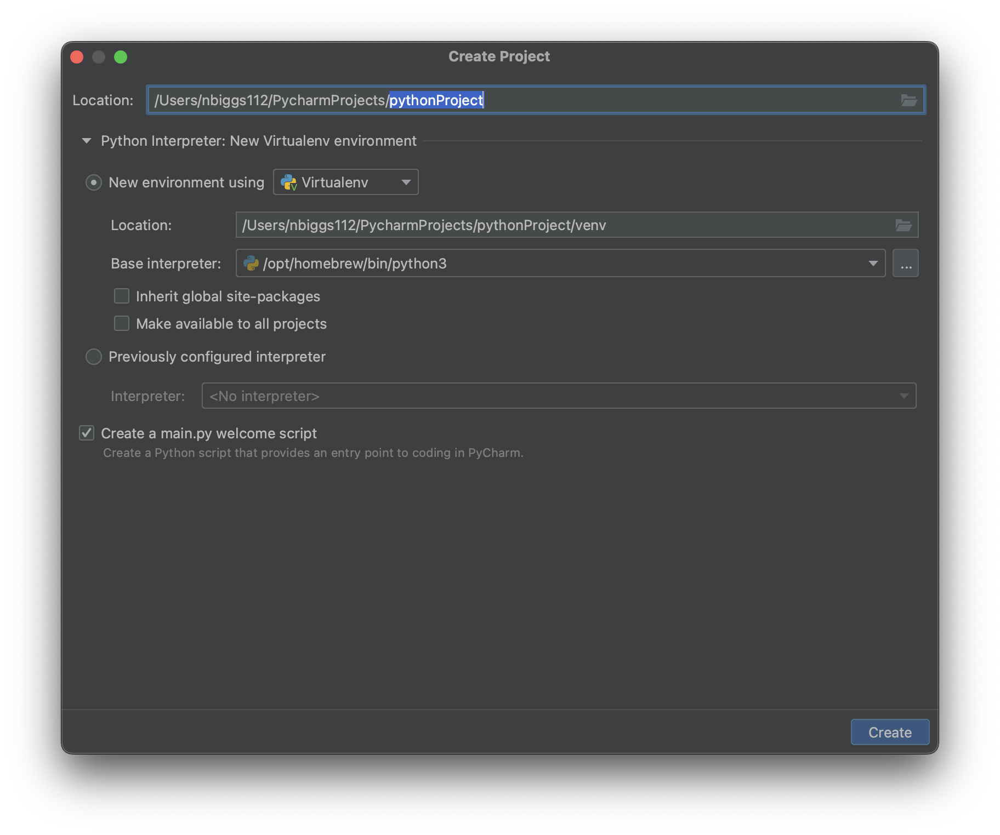
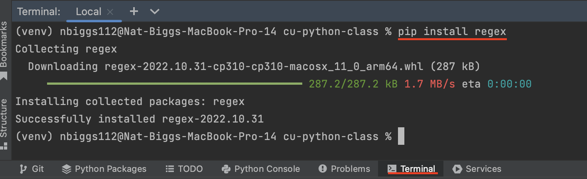
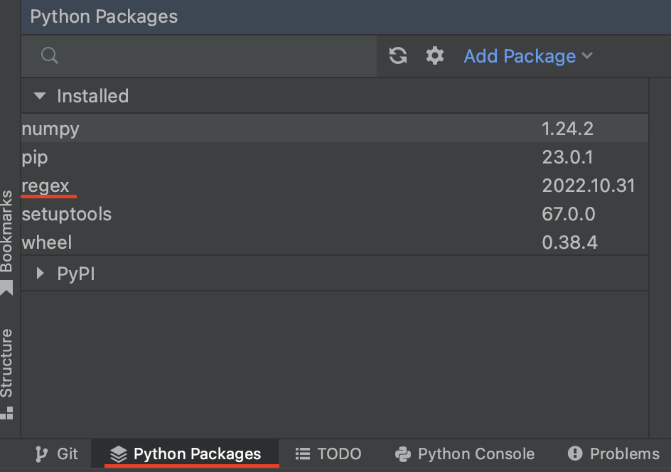
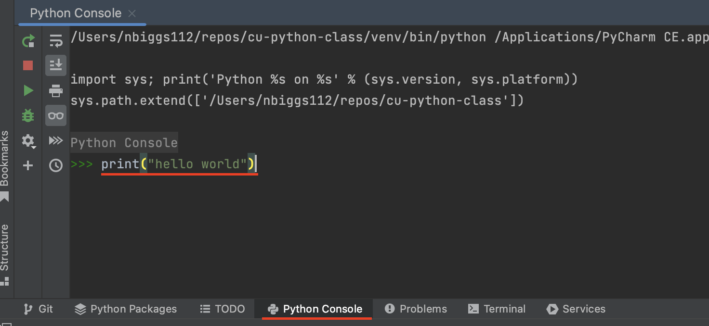
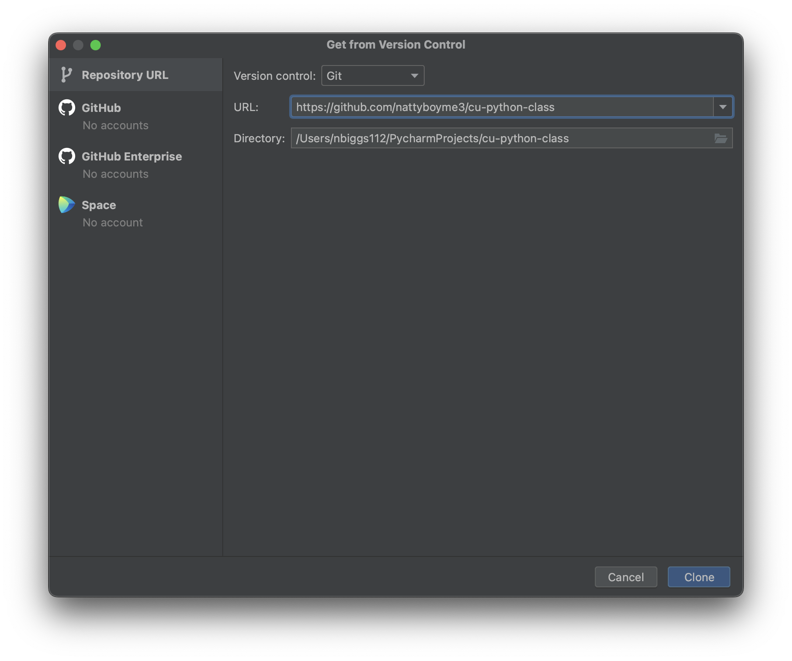
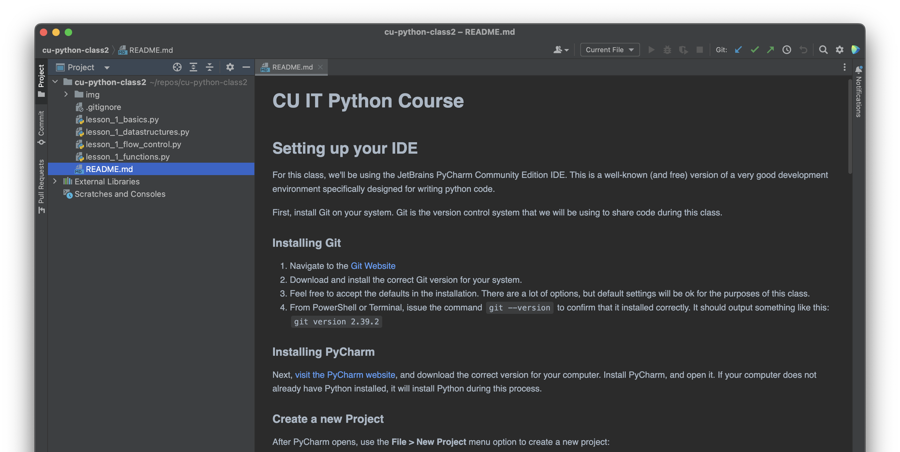

# CU IT Python Course
## Setting up your IDE
For this class, we'll be using the JetBrains PyCharm Community Edition IDE. This is a well-known (and free) version of a 
very good development environment specifically designed for writing python code.

First, install Git on your system. Git is the version control system that we will be using to share code during this class.

### Installing Git

1. Navigate to the [Git Website](https://git-scm.com/download)
2. Download and install the correct Git version for your system.
3. Feel free to accept the defaults in the installation. There are a lot of options, but default settings will be ok for the purposes of this class.
4. From PowerShell or Terminal, issue the command `git --version` to confirm that it installed correctly. It should output something like this: `git version 2.39.2`

### Installing PyCharm

Next, [visit the PyCharm website](https://www.jetbrains.com/pycharm/download/), and download the correct 
version for your computer. Install PyCharm, and open it. If your computer does not already have Python installed, it will install Python during this process.

### Create a new Project

After PyCharm opens, use the **File > New Project** menu option to create a new project: 

Name your project, and make sure (as in the image above) that you've chosen to use a Virtualenv. 
Leave everything else as defaults, and click **create**.

> **What is a virtualenv?** 
> 
> _Virtualenv stands for "Virtual Environment". While you will have a global, operating-system_
> _level python environment, it's often useful to separate your python environments for the purpose of better control_ 
> _over what packages are installed, and how those packages are configured._

### Installing Python Packages

Some of the exercises we will do later in the class require libraries, which are pre-written in Python 
(and sometimes other languages) that are bundled together and downloadable from [PyPi](http://pypi.org), 
the Python Package Repository.

Python comes with a package manager called Pip. To use Pip to install a package, open the terminal 
(also at the bottom of your PyCharm screen for convenience), and type `pip install <package_name>`

> ***Note**: This terminal is convenient to use, because automatically runs your commands within the virtual environment we set up earlier.*

PyCharm also comes with a built-in front-end for Pip, which you can also get to from the bottom bar:

### Run your first commands in Python

From the bottom of your screen, select **Python Console**. 
In the space next to the text `>>>`, type `print('hello world')` and then press <kbd>Enter</kbd>. 

You should receive `hello world` as output. 

**Congratulations! You've run your first command in Python!**

## Preparing for the remainder of this class

The exercises in this class will be provided to you through a GitHub repo. To download a local copy of this repo, 
go to the **Git** menu at the top of your screen, and choose **Clone...**

Paste in the following URL: 
`https://github.com/nattyboyme3/cu-python-class`

Once the process finishes, you'll have your own copy of this repository, and you can begin to work through the exercises.

