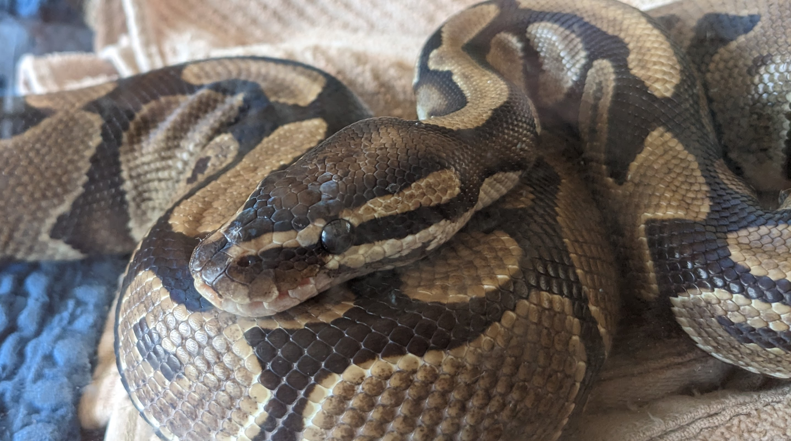

# Meet a Python! Learn Python! 

We won't teach you to talk to snakes, but if you're interested in learning some Python basics for use at work or at home, join us for a *free* 4-session Python class, with the goal of helping you Extract, Transform, and Load data. 

To celebrate the beauty and simplicity of our favorite programming language, we've enlisted the help of **Spots, a real 4-foot ball python**, who will be entertaining visitors in Tyler 206I from 4-5 p.m. today. Spots is a gentle snake, who loves to help people learn more about the programming language that shares the name of his kin. 

## Why Python?

Python (the programming language) is a **simple** but **powerful** tool, with easy-to-learn syntax and a wide variety of available pre-written libraries. If you use a computer for your job, Python can help you automate repetitive tasks, and do more with your data. 

If you already use Excel, learning Python can open a whole new world of possibilities for how you can use, transform, and understand the data you already use every day. 

## No Experience Required
Not a programmer? Not a Parseltongue? No problem! We'll start simple and build on what you already know. 

>"You already know how to program in Python... you just don't know it yet!" ~ Micah Cooper, CIO

## Topics

This class (taught  by CU IT's own **Micah Cooper** and **Nat Biggs**) will cover: 
- Basic Python syntax and flow control
- Getting data into python from files
- Getting data from the internet using Web APIs
- Processing and transforming data using Pandas
- Interpreting and Visualizing data in python

## Class Schedule
- **Session 1:** Thursday, March 16th, 2-4 p.m.
- **Session 2:** Thursday, March 23rd, 2-4 p.m.
- **Session 3:** Friday, April 7th, 2-4 p.m.
- **Session 4:** Friday, April 14th, 2-4 p.m.